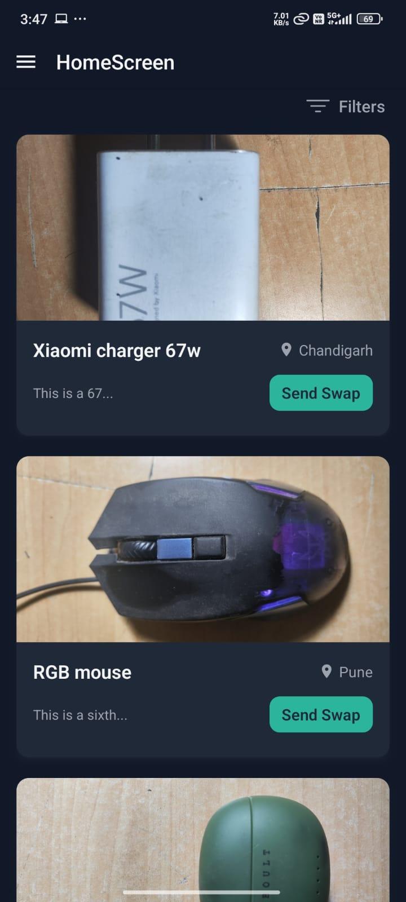
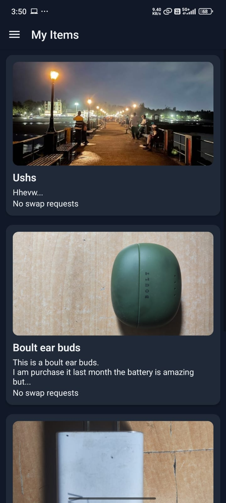
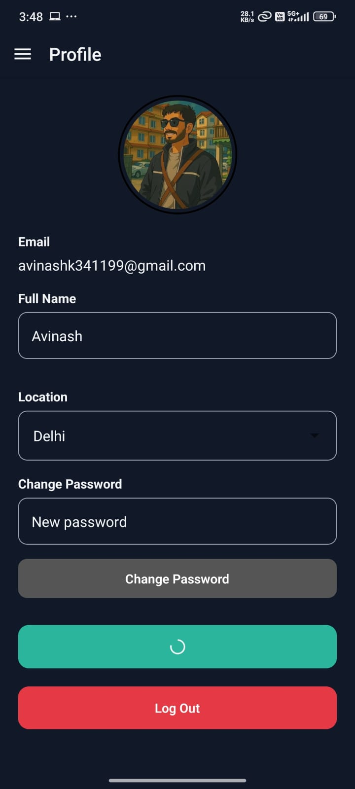
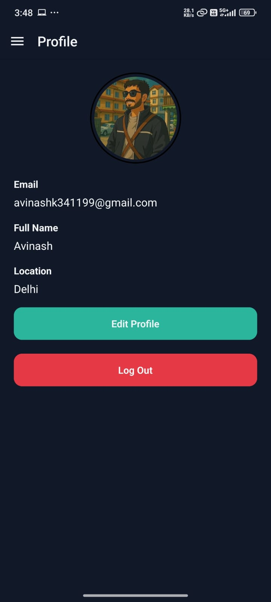
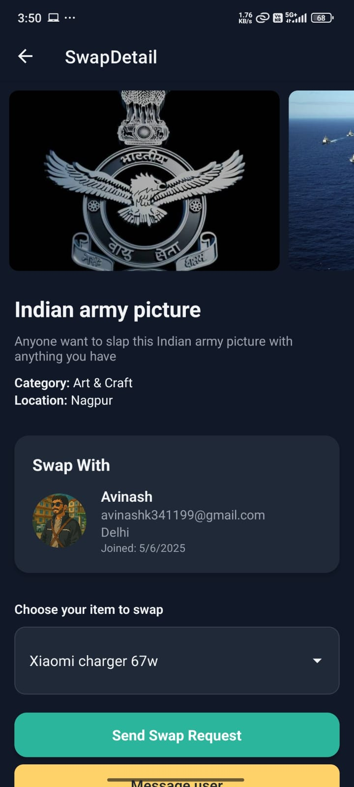
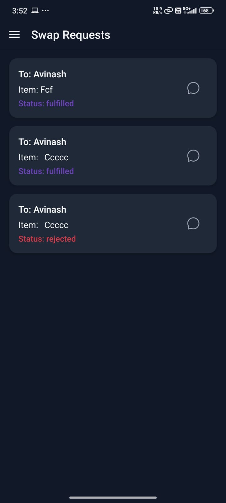
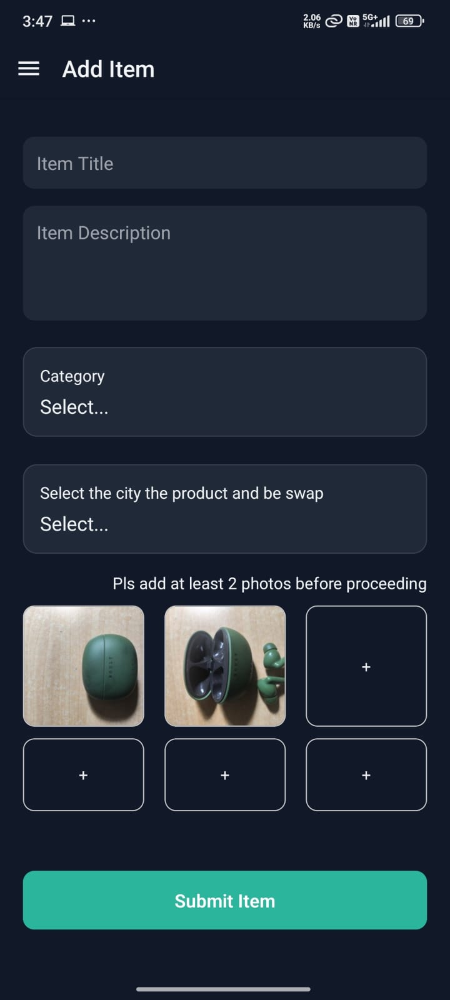

# 🔁 Swap App

Swap App is a mobile application built with **React Native** and **Expo** that allows users to list items and **swap** them with other users. Users can **send swap requests**, **accept/reject offers**, and **chat** to coordinate exchanges. Once completed, swaps can be marked as **fulfilled**.

---










## ✨ Features

- 🔐 User authentication (register & login)
- 📦 Upload items with images and descriptions
- 🔁 Send and receive swap requests
- ✅ Accept or reject swap offers
- 💬 In-app chat with other users
- 📍 Track swap statuses: pending → accepted → fulfilled
- 🌗 Light & dark mode support

---

## 📲 Getting Started

### 1. Clone the repo

```bash
git clone https://github.com/avinashkumarkurmi/Swap.git
cd Swap


### 2. Install dependencies

npm install


### 3. Start the app

npx expo start

---


 ### backend link

 https://github.com/avinashkumarkurmi/Swap-backend